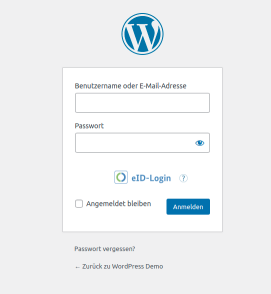

# Funktionalitäten einer eID-Login Implementierung

Für die Implementierung eines eID-Login sind diverse Funktionalitäten umzusetzen.

Manche davon sind unabdingbar, um die Nutzung eines eID-Login zu ermöglichen, andere wiederrum sind in Teilen oder ganz als optional zu betrachten und es liegt beim Entwickler selbst zu entscheiden, ob und in welchem Umfang diese Funktionalität umsetzt wird.

## Funktionalitäten für Administratoren der Webanwendung

Einige Funktionalitäten müssen Benutzern mit Administrationsrechten bezüglich der Webanwendung vorbehalten sein.
Über ein ggf. vorhandenes Rollenkonzept der Zielplattform ist sicherzustellen, dass diese Funktionalitäten vor unbefugten Zugriffen geschützt sind.

### Erstellen und Speichern einer Konfiguration für die Kommunikation zwischen Dienstanbieter und Identitätsanbieter

Kommt das SAML Protokoll für den Austausch von Authentifizierungsinformationen zum Einsatz, wie das beim eID-Login der Fall ist, so wird auf Seiten des Dienstanbieters eine Konfiguration benötigt, welche die Verbindung zum Identitätsanbieter spezifiziert.

Diese umfasst folgende Bereiche:

* Eine Konfiguration, welche den zu nutzenden Identitätsanbieter (IdP) beschreibt.
Die entsprechenden Werte stammen vom IdP und müssen im Dienstanbieter hinterlegt werden:
    * Die EntityID des IdP
    * Die Single-Sign-On URL des IdP
    * Das Signaturzertifikat des IdP
    * Das Verschlüsselungszertifikat des IdP (optional)
* Eine Konfiguration, welche den Dienstanbieter (SP) selbst beschreibt:
    * Die EntityID des SP
    * Das Signaturzertifikat des SP
    * Das Verschlüsselungszertifikat des SP (optional)
    * Ein Schalter, welcher den eID-Login aktiviert oder deaktiviert (optional)
* Eine optionale Konfiguration, welche Parameter für die Kommunikation zwischen SP und IdP festlegt:
    * Erzwingen einer unabhängig vom Transportprotokoll verschlüsselten Übertragung der Authentifizierunginformationen (nur möglich, wenn der IdP dies unterstützt)
    * Falls TR-03130 zum Einsatz kommt, kann optional angegeben werden, welche Attribute der eID angefordert werden.
    Dies kann in Form eines XML Textes erfolgen, welcher verschlüsselt als AuthnRequest-Extension mit übertragen wird (siehe [BSI TR-03130 eID-Server Teil 1](https://www.bsi.bund.de/SharedDocs/Downloads/DE/BSI/Publikationen/TechnischeRichtlinien/TR03130/TR-03130_TR-eID-Server_Part1.pdf) Kapitel 4.7.2).

Wo und wie diese Konfigurationsdaten eingegeben und gespeichert werden, hängt von der jeweiligen Implementierung ab.
In den Implementierungen, welche im Zuge des eID-Templates Projektes entstanden sind, erfolgt die Erstellung bzw. Bearbeitung der Konfiguration über einen mehrstufigen Wizard bzw. ein Webformular.


### Aktualisierung der Dienstanbieterzertifikate für die Kommunikation mit dem Identitätsanbieter (optional)

Die zum Dienstanbieter gehörigen Zertifikate für die Signatur von Anfragen an bzw. die Verschlüsselung der Antworten vom Identitätsanbieter sollten eine begrenzte Gültigkeitsdauer haben.

Es bietet sich daher an, dem Administrator der Webanwendung eine Möglichkeit zu schaffen, diese Zertifikate unkompliziert zu erneuern.
Im Idealfall werden zwei Zertifikatspaare gleichzeitig genutzt und der Identitätsanbieter erkennt die neuen Zertifikate automatisch, so dass nach Entfernen der alten ein reibungsloser Übergang entsteht.

Bei den eID-Templates ist ein Mechanismus enthalten, welcher die Gültigkeitsdauer dieser Zertifikate regelmäßig prüft und eine automatische Erneuerung mit einer gewissen Zeitspanne des parallelen Betriebes von neuen und alten Zertifikaten durchführt.
Die Administratoren der Webanwendung werden per E-Mail über diese Schritte informiert.

\newpage
## Funktionalitäten für SAML und TR-03130

Für die Rolle der Webanwendung als Dienstanbieter in der Kommunikation mit dem SAML Protokoll bzw. nach TR-03130 müssen folgende frei zugängliche Endpunkte von der Webanwendung bereitgestellt werden.

### SAML Metadaten-URL

Über den Endpunkt der SAML Metadaten-URL des Dienstanbieters kann der Identitätsanbieter die von ihm für die Kommunikation benötigten Daten des Dienstanbieters, wie "Assertion-Consumer-URLs" (kurz ACS), Zertifikate etc. abfragen.

Oft kann diese URL bei der Registrierung des Dienstanbieter beim Identitätsanbieter angegeben werden, so dass die dort enthaltenen Daten nicht händisch eingegeben werden müssen.


### Weiterleitung des eID-Client zum eID-Server für TR-03130

Falls eine Kommunikation nach TR-03130 erfolgen soll, so muss ein Endpunkt bereitgestellt werden, um den [eID-Client](https://www.bsi.bund.de/DE/Themen/Unternehmen-und-Organisationen/Standards-und-Zertifizierung/Technische-Richtlinien/TR-nach-Thema-sortiert/tr03124/TR-03124_node.html;jsessionid=6CFC66D068CEF99C242F0ED3B4A7A24C.internet082) zum eID-Server weiter zu leiten.
Dieser Endpunkt wird TcTokenRedirect-URL genannt.
Genauere Informationen finden sich in den Sequenzdiagrammen weiter unten.

### SAML Assertion-Consumer-URLs

An den ACS-URLs verarbeitet der Dienstanbieter die vom Identitätsanbieter zurückkommenden Identitätsinformationen (in SAML "Assertion" genannt).

TR-03130 verpflichtet zur Nutzung des HTTP Redirect Binding ([siehe SAML Binding Spezifikation](https://docs.oasis-open.org/security/saml/v2.0/saml-bindings-2.0-os.pdf) Kapitel 3.4), während sonst in den allermeisten Fällen das HTTP Post Binding zum Einsatz kommt ([siehe SAML Binding Spezifikation](https://docs.oasis-open.org/security/saml/v2.0/saml-bindings-2.0-os.pdf) Kapitel 3.5).
Je nachdem, ob nun SAML nach TR-03130 oder Standard-SAML für die Kommunikation mit dem Identitätsanbieter genutzt wird, müssen diese Endpunkte in der Lage sein, eine GET Anfrage (TR-03130) oder eine POST Anfrage (Standard-SAML) zu verarbeiten.

***ACHTUNG:*** Da bei der Nutzung von TR-03130 die Identitätsinformationen in URL-Parametern übertragen werden und nicht im Body wie bei einer POST Anfrage üblich, kann die vom Identitätsanbieter aufgerufene URL so lang werden, dass sie von einem standardmäßig konfigurierten Webserver abgelehnt wird.
Der Webserver ist daher so zu konfigurieren, dass er auch längere Anfragen akzeptiert.
Für den Apache Webserver müsste dies in der globalen Serverkonfiguration oder in der nach alphanumerischer Reihenfolge ersten vHost Konfiguration erfolgen und könnte z.B. so aussehen:
```shell
# /etc/apache2/apache2.conf
LimitRequestLine 128000
```
Die entsprechende Konfigurationsoption ist [hier](http://httpd.apache.org/docs/2.4/en/mod/core.html#limitrequestline) zu finden.

### Wiederaufnahme der Kommunikation mit dem Browser

Vom Dienstanbieter muss ein Endpunkt bereitgestellt werden, an welchem im Falle von TR-03130 die Kommunikation mit dem Browser wieder aufgenommen werden kann, nachdem der eID-Client die SAML-Assertion des eID-Server an der ACS-URL des Dienstanbieters abgeliefert hat und seine Arbeit somit getan ist.
Für den Standard-SAML Ablauf ist Zweck dieses Endpunktes, dass der Austausch von Cookies und die damit verbundene Fortführung einer gegebenenfalls bestehenden Session zwischen Browser und Dienstanbieter wieder aufgenommen werden kann.
Dieser Endpunkt kann "Resume-URL" genannt werden.

## Funktionalitäten für Benutzer der Webanwendung

Folgende Funktionalitäten müssen für die "einfachen" Benutzer der Webanwendung verfügbar sein, um einen eID-Login zu realisieren. Sie sollten jedoch nur dann erreichbar bzw. sichtbar sein, wenn der eID-Login durch den Administrator eingerichtet und aktiviert wurde.

### Verknüpfung einer eID mit einem Benutzerkonto

Ein an der Webanwendung angemeldeter Benutzer muss in der Lage sein, eine eID mit seinem Benutzerkonto zu verknüpfen.
Dies stellt die Voraussetzung dar, das entsprechende Benutzerkonto bei der Anmeldung mit dem eID-Login zu identifizieren und den Benutzer anzumelden.
Dem Benutzer ist somit die Funktionalität, eine solche Verknüpfung zu erstellen, auf einer zugriffsgeschützen Seite der Webanwendung zur Verfügung zu stellen.

### Löschen der Verknüpfung einer eID mit einem Benutzerkonto

Eine bestehende Verknüpfung einer eID mit einem bestimmten Benutzerkonto der Webanwendung muss durch den entsprechenden Benutzer gelöscht werden können.
Wie üblich beim Löschen von Daten ist hier eine entsprechende Sicherheitsabfrage guter Stil.

### Unterbinden einer Anmeldung mit Benutzername und Passwort (optional)

Um den Benutzern der Webanwendung die Möglichkeit zu geben, die Sicherheit ihres Benutzerkontos zu erhöhen, kann man den Benutzern eine Möglichkeit anbieten, die Anmeldung mittels Eingabe von Benutzername und Passwort zu unterbinden, so lange der eID-Login für die Webanwendung aktiviert ist.
Nach einer Deaktivierung des eID-Login muss auch eine Anmeldung via Benutzername und Passwort wieder möglich sein.
Dabei ist zudem darauf zu achten, dass es für den Anwender die Möglichkeit geben muss, diese Einschränkung rückgängig zu machen.
Im Rahmen des eID-Templates Projektes wurde die Einschränkung aufgehoben, wenn ein Benutzer sein Passwort zurückgesetzt hat.


\newpage

### Hinweis auf die Möglichkeit des eID-Login (optional)

Falls die Zielplattform der Implementierung über ein Benachrichtigungssystem verfügt, mit welchen Benutzer auf bestimmte Aspekte der Plattform aufmerksam gemacht werden können, so bietet es sich an, Benutzer über eine neu aktivierte Möglichkeit zum eID-Login zu informieren.

### Anmelden mit eID

Das Anmelden mit einer eID an der Webanwendung ist das Kernstück der benötigten Funktionalitäten.
Die jeweilige Ausprägung ist von der Zielplattform der Implementierung abhängig.

Eine optionale Verlinkung zur Website https://eid.services mittels eines Hilfe-Symbols (z.B. ein Fragezeichen) kann den Benutzern zur Seite gestellt werden.



\newpage

## Benutzerfreundlichkeit der Funktionalitäten

Um die Integration des eID-Login so benutzerfreundlich wie möglich zu gestalten, sind für die Benutzerschnittstellen der Funktionalitäten die jeweiligen Richtlinien und Vorgaben der Zielplattform, soweit vorhanden, zu respektieren.

Wo immer möglich soll auf die von der Plattform bereitgestellten Einordnungen, Standardelemente, Abläufe und Vorgehen zurückgegriffen werden.

Die Funktionalitäten bezüglich der Einstellungen des eID-Login sind, wo es möglich ist, im Bereich "Sicherheit" oder ähnlichem anzusiedeln.

Wo es sich in der Benutzerschnittstelle anbietet, ein grafisches Symbol zu platzieren, wie z.B. für ein Modul, welches die Konfigurationsoptionen für einen Administrator bereitstellt, soll das offizielle eID-Logo des Personalausweises genutzt werden.
Dessen Nutzung kann [hier](https://www.personalausweisportal.de/SharedDocs/artikel/Webs/PA/DE/informationsmaterial/grafiken-bilder/logo_dateien_artikel.html) beantragt werden.

Bezüglich des Aufbaus und der Umsetzung der Benutzerschnittstelle sei hier ansonsten auf den bestehenden [Best-Practice
Leitfaden](https://www.personalausweisportal.de/SharedDocs/downloads/Webs/PA/DE/informationsmaterial/informationen-formulare-diensteanbieter/Leitfaden_fuer_diensteanbieter.pdf?__blob=publicationFile&v=6)
für Dienste mit der Online-Ausweisfunktion verwiesen.
