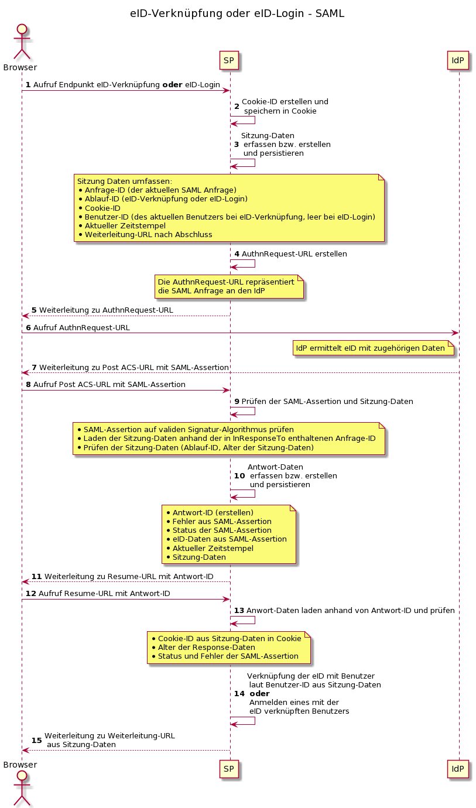
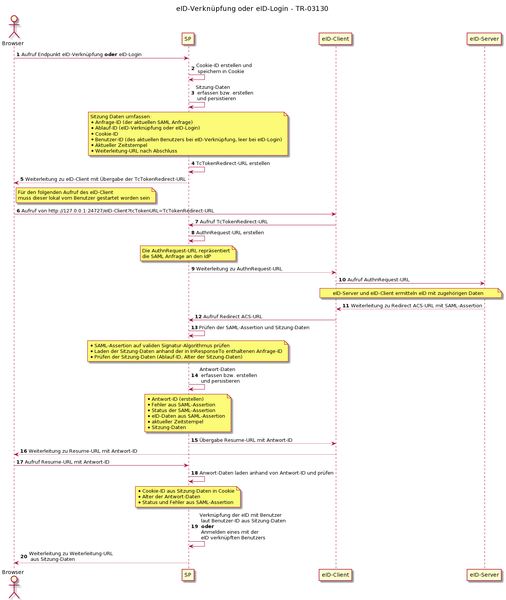

# Sequenzdiagramme

Es wird hier dargestellt, wie die Verknüpfung einer eID mit einem Benutzerkonto der Webanwendung bzw. einem eID-Login an der Webanwendung realisiert werden kann.
Bezogen auf den Ablauf sind diese Vorgänge sehr ähnlich.
Es wird in beiden Fällen durch den Dienstanbieter (SP) eine eID (bzw. deren abgeleitetes Pseudonym und ggf. ihre Attribute) beim Identitätsanbieter (IdP) angefordert.

Welcher dieser Vorgänge gerade durchgeführt wird, kann anhand einer "Ablauf-ID" festgelegt werden.
Je nach Ablauf-ID (also "eID-Verknüpfung" oder "eID-Login") ist bei der Verarbeitung der SAML Assertion natürlich unterschiedlich zu verfahren.

Bei der Erstellung von IDs für Sitzung-Daten bzw. Antwort-Daten ist darauf zu achten, kryptografisch sicher erstellte Werte zu verwenden, so dass diese nicht erraten oder berechnet werden können.

## Ablauf bei SAML

\newpage

## Ablauf bei TR-03130

Im Falle der Kommunikation nach TR-03130 gibt es eine weiteres System, mit dem der SP interagieren muss, den eID-Client.
Das Ablauf stellt sich also etwas anders dar als bei der Benutzung von reinem SAML.

