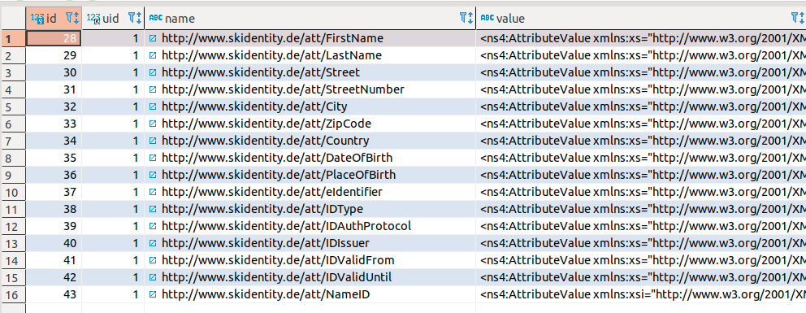

# Ausblick

Die bisher umgesetzten Implementierungen können und sollen als Vorlage dienen, um die eID auch in weiteren Plattformen für eine einfache und sichere Authentifizierung nutzbar zu machen.
Dabei kann im Rahmen des Projektes eID-Templates der Service [SkIDentity](https://skidentity.de) der [ecsec GmbH](https://ecsec.de) kostenfrei für die starke Authentifizierung auch für Komponenten von weiteren Plattformen genutzt werden.

Die Technologie der Onlineausweis-Funktion des Personalausweises bietet aber noch mehr.
Es können, ein entsprechendes Berechtigungszertifikat des Identitätsanbieters und die Zustimmung des Ausweisinhabers vorausgesetzt, auch andere Attribute des Ausweises als nur das Pseudonym abgefragt werden.
Dies wären z.B. die hinterlegten Adressdaten oder das Geburtsdatum.
Werden diese Daten im Dienstanbieter gespeichert, so können sie von weiteren Komponenten wie z.B. im Bereich e-Commerce für die Altersverifizierung oder die Ermittlung der Versandadresse verwendet werden.

Es bleibt daher zu hoffen, dass mit Hilfe der bestehenden Implementierungen und dieses Dokuments für weitere Plattformen Komponenten entwickelt werden, welche die Onlineausweis-Funktion des Personalausweises für Anwender einfach und sicher nutzbar machen und auf diesem Wege das Internet ein wenig sicherer machen.
